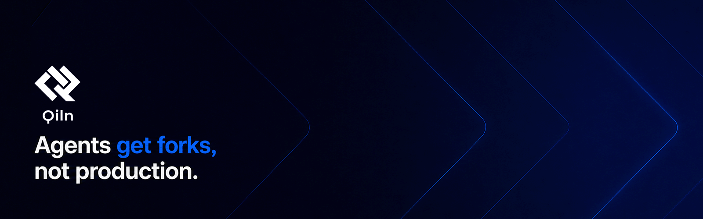

**Persistent AI workspaces for ComfyUI and GPU-backed creation apps.**  
Run ComfyUI, VS Code, Jupyter, vLLM, Ollama, n8n, and workflow APIs on your own GPU server — with real folders, model vaults, snapshots, HTTPS routes, GPU leases, and no Kubernetes.

[](./LICENSE)
[](#status)
[](#first-release-scope)
[](#license)
[](https://qiln.com)

<p>
  <a href="https://qiln.com"><strong>Join the waitlist</strong></a>
  ·
  <a href="https://discord.gg/eNaxauuyZ6">Discord</a>
  ·
  <a href="#status">Status</a>
  ·
  <a href="#why-qiln-exists">Why Qiln exists</a>
  ·
  <a href="#how-it-works">How it works</a>
  ·
  <a href="#first-release-scope">First release scope</a>
  ·
  <a href="#license">License</a>
</p>

Qiln turns a bare-metal GPU server into managed, persistent AI workspaces.

The first wedge is ComfyUI because ComfyUI users feel the pain most directly: large models, fragile custom nodes, path-sensitive workflows, disposable GPU pods, scattered outputs, exposed ports, and environments that disappear right when the workflow starts to matter.

Qiln gives that work a stable home:

- persistent ComfyUI workspaces
- private model and dataset vaults
- real folders for inputs, outputs, configs, and custom nodes
- VS Code, Jupyter, n8n, FastAPI, vLLM, Ollama, and Open WebUI companion apps
- snapshots before risky changes
- stable HTTPS routes
- GPU lease primitives for scarce GPU capacity
- browser-based admin and user flows
- experimental: GUI streaming to an HTML canvas for selected graphical apps
- no Kubernetes required

This repository is the future public source home for **Qiln Community**: the open-source, self-managed engine for running Qiln on GPU hardware you own.

Qiln is developed by [IonSignal, Inc.](https://ionsignal.com).

## Contents

- [Status](#status)
- [Why Qiln exists](#why-qiln-exists)
- [Qiln Community, Managed, and Appliance](#qiln-community-managed-and-appliance)
- [Who Qiln is for](#who-qiln-is-for)
- [What Qiln does](#what-qiln-does)
- [Core concepts](#core-concepts)
- [How it works](#how-it-works)
- [What Qiln is not](#what-qiln-is-not)
- [First release scope](#first-release-scope)
- [Planned repository layout](#planned-repository-layout)
- [Documentation](#documentation)
- [Stack](#stack)
- [License](#license)
- [Security](#security)

## Status

Qiln is pre-release infrastructure.

The public source will open here for the first usable alpha, `v0.1.0`. Until then, this repository is intentionally minimal and serves as the future public source home for Qiln Community.

The private development branch currently includes core primitives for:

- Incus-based per-user workspace provisioning
- declarative blueprint loading and validation
- ZFS-backed vault creation, cloning, quotas, and snapshots
- GPU lease lifecycle for supported workloads
- automatic HTTPS routing through Caddy
- experimental Selkies-backed graphical app streaming
- NATS-based internal eventing
- Postgres-backed state
- Fastify/tRPC APIs
- browser-based admin UI for workspaces, vaults, blueprints, users, and operations

The public `v0.1.0` release is gated on:

- a repeatable one-command installer
- finalized admin and user UI flows
- a usable vault/file browser with image previews and file editing
- model import flows, including Hugging Face integration
- documented Incus, ZFS, NVIDIA, and Caddy setup
- stable blueprint examples for ComfyUI and common companion workloads
- preparation of the source tree for external review and contribution

Qiln is not publicly installable yet.

If you own GPUs and want to help shape the alpha, [join the waitlist](https://qiln.com).

We are prioritizing:

1. **Design partners** running real GPU hardware with real users.
2. **Studios, labs, founders, and internal teams** with persistent ComfyUI or GPU workspace pain.
3. **Discord community members** willing to test, break things, and give feedback.
4. **GitHub stars/watchers** who want to follow the public release.

## Why Qiln exists

Disposable GPU pods are fine for disposable jobs.

They are a bad fit for serious ComfyUI and GPU-backed creation workflows.

Once you have private checkpoints, LoRAs, VAEs, ControlNets, datasets, custom nodes, workflow JSON, output folders, wrapper APIs, and automation scripts, the job is no longer “rent a GPU for an hour.”

The job is:

> Open your AI workspace and keep building.

Qiln is built around that job.

Instead of rebuilding a GPU pod, re-uploading models, fixing custom nodes, exposing random ports, and worrying about credits, Qiln gives users a persistent workspace with the files, routes, GPU access, snapshots, and companion tools needed to keep working.

ComfyUI is the beachhead. The broader product is a workspace layer for GPU-backed creative and AI development environments.

## Qiln Community, Managed, and Appliance

Qiln has three related delivery models.

### Qiln Community

Open-source, self-managed Qiln for people who own GPU hardware.

Use it to turn your own GPU server into managed AI workspaces without Kubernetes.

Qiln Community is:

- Apache 2.0 core
- no CLA
- single-node first
- Incus-based isolated workspaces
- ZFS-backed vaults, clones, and snapshots
- declarative blueprints
- GPU lease primitives
- Caddy HTTPS routing
- pre-release alpha until public `v0.1.0`

### Qiln Managed

Hosted persistent AI workspaces run by IonSignal.

Use it when you want persistent ComfyUI and GPU-backed creation workspaces without operating GPU infrastructure.

Qiln Managed is built for:

- persistent ComfyUI workspaces
- private model storage
- direct checkpoint, LoRA, VAE, and ControlNet uploads
- custom node onboarding
- VS Code, Jupyter, n8n, FastAPI, vLLM, Ollama, and companion services
- stable HTTPS routes
- snapshots
- reserved high-VRAM GPU capacity
- experimental browser-streamed graphical apps for selected GUI workloads

### Qiln Appliance

Qiln installed and managed on customer-owned hardware.

Use it when your studio, lab, or organization needs a private AI workspace appliance on owned GPUs, servers, racks, or datacenter infrastructure.

Qiln Appliance can include:

- custom blueprints
- identity integration
- backup and restore planning
- monitoring
- updates
- support retainers
- deployment guidance for owned GPU servers

## Who Qiln is for

Qiln is for people who need persistent GPU-backed AI workspaces instead of disposable pods or fragile local installs.

Good fits include:

- commercial ComfyUI users with private models, custom nodes, and serious output workflows
- creative studios giving artists sanctioned, persistent GPU workspaces
- founders building visual AI products from ComfyUI or workflow backends
- internal AI and innovation teams replacing unmanaged GPU cloud usage
- research groups sharing a few expensive GPUs
- small labs that want Jupyter, ComfyUI, vLLM, Ollama, and Open WebUI without Kubernetes
- serious homelabbers who want team-grade isolation on their own GPU server

Qiln is especially relevant if you are currently dealing with:

- rebuilt RunPod-style GPU pods
- broken custom node environments
- duplicated model folders across machines
- exposed ComfyUI ports
- unstable URLs
- no clean path from visual workflow to API endpoint
- unmanaged GPU usage inside a team
- Kubernetes pressure before you have a platform team

## What Qiln does

Qiln turns one bare-metal GPU machine into a managed AI workspace host.

A Qiln workspace can include:

- an isolated Incus environment
- one or more ZFS-backed vaults
- persistent folders for models, datasets, inputs, outputs, configs, and code
- GPU lease access for supported workloads
- snapshots and rollback paths
- HTTPS routes through Caddy
- app-specific configuration from a declarative blueprint
- browser-accessible workspace, file, and admin UI

Qiln starts with ComfyUI, then expands through companion blueprints for the tools people already need around their workflows:

- VS Code / code-server
- JupyterLab
- n8n
- FastAPI wrappers
- vLLM
- Ollama
- Open WebUI
- model and file tools

The goal is not to become a generic PaaS.

The goal is to make GPU-backed AI creation environments persistent, understandable, private, and recoverable.

## Core concepts

Qiln is organized around workspace objects, not raw infrastructure objects.

The important concepts are:

- **Workspaces** — persistent, isolated environments for users, projects, and apps.
- **Apps** — ComfyUI, VS Code, Jupyter, n8n, vLLM, Ollama, Open WebUI, FastAPI wrappers, and similar AI workflow tools.
- **Blueprints** — declarative definitions for repeatable workspace provisioning.
- **Model vaults** — storage for checkpoints, LoRAs, VAEs, ControlNets, embeddings, and other model files.
- **Dataset vaults** — storage for source datasets, references, training data, and project inputs.
- **Output folders** — persistent locations for generated images, video, logs, artifacts, and exports.
- **GPU leases** — controlled access to scarce GPU capacity for workspaces that need acceleration.
- **Snapshots** — recovery points before risky dependency, model, workflow, or custom-node changes.
- **Routes** — stable HTTPS URLs for workspace apps.
- **Endpoints** — API paths for workflows that need to be called by other systems.
- **Projects and users** — the organizational layer for teams, studios, labs, and internal groups.
- **Graphical sessions** — Selkies-backed sessions that stream a complete GUI to an HTML canvas in the browser.

Under the hood, Qiln uses Incus, ZFS, Caddy, NATS, Postgres, Fastify, tRPC, and Vue 3.

Those are ingredients. The product is the workspace.

## How it works

At a high level:

1. An admin installs Qiln on a bare-metal GPU server.
2. Qiln prepares the host for isolated workspaces, storage vaults, GPU access, and HTTPS routing.
3. An admin imports or configures blueprints for ComfyUI and companion apps.
4. A user launches a persistent workspace from a blueprint.
5. Qiln provisions an isolated Incus environment.
6. Qiln mounts the required vaults and folders.
7. Qiln attaches GPU access when the workload needs acceleration.
8. Qiln routes the workspace through HTTPS using Caddy.
9. Users work from the browser while keeping models, outputs, configs, code, and custom nodes in place.
10. Admins manage workspaces, vaults, users, leases, snapshots, routes, and events from the browser UI.

For supported apps, Qiln can integrate more deeply.

For ComfyUI, the goal is to make model management, custom node work, output browsing, snapshots, file operations, GPU access, and route management feel native instead of like infrastructure chores.

## What Qiln is not

### Qiln is not cheap GPU rental

If you need occasional cheap GPU-hours, disposable experiments, or extremely spiky batch jobs, raw GPU clouds may be the right answer.

RunPod, Vast.ai, Lambda, Modal, and similar platforms can be good choices when persistence does not matter.

Qiln is for the cases where persistence does matter:

- private models
- custom nodes
- stable routes
- real folders
- repeatable workflows
- snapshots
- team access
- workflow endpoints
- predictable infrastructure ownership or reserved capacity

They rent GPUs. Qiln gives you a persistent AI workspace around GPU capacity.

### Qiln is not Kubernetes

Kubernetes, Run:ai, Kubeflow, Slurm, and related systems can make sense for large GPU fleets, formal cluster operations, and teams with platform engineers.

Qiln is for the studio, lab, founder, or small team before that point.

It is the answer when you have one serious GPU server, real users, real workflows, and no desire to become a platform team just to run ComfyUI, Jupyter, vLLM, Ollama, or workflow APIs.

### Qiln is not a generic PaaS

Qiln is not trying to host every app.

Good blueprint fits include:

- ComfyUI
- VS Code / code-server
- JupyterLab
- n8n
- FastAPI workflow wrappers
- vLLM
- Ollama
- Open WebUI
- TensorBoard
- Kohya
- model and file tools

Bad fits include:

- WordPress
- CRM systems
- billing systems
- generic SaaS hosting
- arbitrary production microservices
- managed databases

Qiln should make AI workspaces better, not become a generic cloud platform.

### Qiln is not a chat UI or local model runner

Qiln can run tools like Open WebUI, Ollama, ComfyUI, JupyterLab, and vLLM.

Those are apps inside the workspace.

Qiln is the workspace layer that provisions, isolates, routes, snapshots, and attaches storage and GPU capacity to those apps.

### Qiln is not hardened public-cloud multi-tenancy

The alpha is aimed at trusted teams, studios, labs, founders, and homelabs.

Do not expose untrusted public tenants to Qiln until the public security model has been hardened and documented.

## First release scope

`v0.1.0` is focused on one machine.

The first public alpha is expected to support:

- one bare-metal GPU server
- NVIDIA-first GPU support
- Incus for workspace isolation
- ZFS for vaults, clones, quotas, and snapshots
- Caddy for HTTPS routing
- NATS for internal eventing
- Postgres for state
- Fastify/tRPC APIs
- Vue 3 browser UI
- browser-based admin workflows
- workspace and vault management
- ComfyUI-first blueprint support
- companion blueprints for common AI workloads

The first release is single-node by design.

Multi-node support may come later, but Qiln is being built to be excellent on one serious GPU server before becoming a cluster product.

Qiln is not recommended for production or untrusted multi-tenant environments until the public alpha has been hardened.

## Planned repository layout

When the source opens, this repository is expected to contain:

```txt
apps/
  qiln/              # runnable Qiln server, API, admin UI, and user UI

packages/
  core/              # shared schemas, events, permissions, NATS/RPC utilities
  engine/            # orchestration engine, Incus/ZFS/GPU/route services
  ui/                # shared UI components

blueprints/
  comfyui/
  vscode/
  jupyterlab/
  n8n/
  fastapi/
  vllm/
  ollama/
  open-webui/

docs/
  concepts/
  install/
  blueprints/
  guides/
  reference/
```

This may change before `v0.1.0`.

The goal is a clean public tree, not a source dump.

## Documentation

Public documentation will live on the Qiln website.

This repository will link to the docs when `v0.1.0` opens.

The documentation set is expected to cover:

- concepts
- architecture
- installation
- ComfyUI workspace setup
- model vaults
- dataset vaults
- output folders
- file browser usage
- blueprint authoring
- GPU lease behavior
- snapshots and rollback
- HTTPS routes
- endpoint patterns
- backup and restore planning
- security model and limitations
- reference material

## Stack

Qiln is built with:

- Incus
- ZFS
- Caddy
- NATS
- Postgres
- Fastify
- tRPC
- Vue 3

The stack is chosen to make single-node GPU workspaces practical: isolated environments, real filesystems, copy-on-write storage, simple HTTPS routing, evented operations, and a browser UI.

## License

Qiln core will be released under Apache 2.0.

The `LICENSE` file is included now to make the intended public-source license explicit before the source lands.

No CLA.

IonSignal may offer managed workspaces, appliance deployments, commercial modules, integrations, and support separately.

The open-source core is intended to remain useful on its own for self-managed, single-node AI workspaces on GPU hardware you own.

## Security

Qiln is pre-release infrastructure and should be treated accordingly.

Qiln Community alpha is for trusted users and controlled environments.

Do not expose untrusted public tenants to Qiln until the security model has been hardened and documented.

Security reporting details are provided in [`SECURITY.md`](./SECURITY.md).
